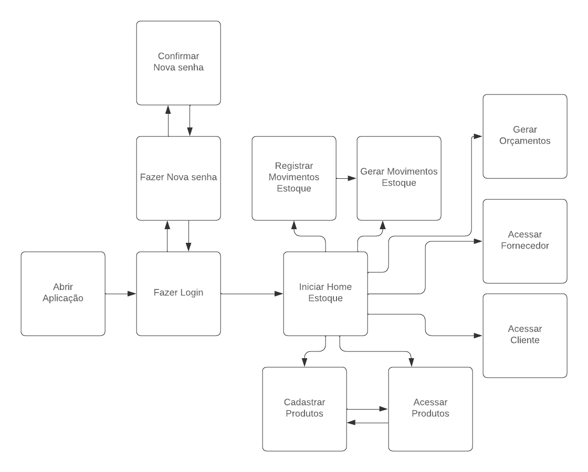

# 4. Projeto da solução
Atualmente a empresa L&R Kits e Freios utiliza o Excel como a principal plataforma para operações e gerenciamentos de várias atividades. Tendo em vista que esta ferramenta é limitada e que é possível implementar meios mais efetivos de trabalho através de um programa mais robusto, nosso objetivo macro neste projeto é criar esta possibilidade para o estabelecimento em questão. 

Em primeiro lugar, podemos identificar um problema de concorrência, considerando o modelo AS IS de todos os processos da L&R. Isto porque não é possível trabalhar em um determinado campo do Excel sem que haja uma tarefa manual de verificação prévia para saber se algum colaborador está trabalhando no programa. Caso alguém já esteja usando a ferramenta, o outro deve esperar pois, se mais de um integrante operar ao mesmo tempo, há grandes chances do documento ser salvo sem todas as modificações que deveriam ser feitas.  

Levando em conta a modelagem TO BE, este problema de uso exclusivo do Excel por um trabalhador é eliminado com o uso do novo programa, ERP – L&R, que está sendo proposto no projeto. Este será capaz de permitir que um número grande de pessoas opere simultaneamente, extinguindo a necessidade de fazer o colaborador perder tempo verificando se o programa já se encontra em uso e ainda de aguardar esta tarefa terminar.  

No quesito segurança dos dados, o fato do programa ser armazenado em nuvem de forma eficiente vai ajudar tanto na não conformidade de concorrência quanto na de segurança de acesso aos dados e documentos da L&R. O fato do Excel não possuir um sistema completo de backups recorrentes e proteção contra exclusão e corrupção faz com que o estado atual da empresa seja de possuir um sistema de trabalho vulnerável. No entanto, esta fragilidade será resolvida com a proposta de implementar em nossa aplicação web um armazenamento em nuvem que deixe os dados seguros e tenha backups pontuais que protejam a empresa de qualquer violação. 

Analisando os processos no modelo AS IS, podemos perceber que são processos simples porém demorados, devido algumas limitações do Excel que são: falta de integridade em seus registros, onde fórmulas ou disposições importantes podem ser alteradas a qualquer momento, até mesmo acidentalmente; pouca usabilidade, pois é necessário conhecimento avançado para fazer fórmulas corretas e criar dinamicidade no fluxo de trabalho desta ferramenta.  

A partir dos problemas de desperdício de tempo identificados no parágrafo anterior, pensamos no ERP – L&R como uma solução que deixaria o fluxo de trabalho da L&R muito mais dinâmico, fluido e fácil. Portanto, a nova ferramenta apresentaria: alta usabilidade, exigindo apenas que o usuário leia o botão com linguagem simples e objetiva, faça uma interpretação e use-o de acordo com a sua demanda; simplificação no uso dos comandos, pois as fórmulas e demais cálculos necessários ficariam prontos como requisitos não funcionais, eliminando qualquer necessidade do usuário gastar tempo para aprender a usar estes recursos; alta integridade nos registros, já que o fluxo mais simples que não necessite da inserção de fórmulas e cálculos deixa estes métodos seguros o suficiente para não serem alterados a qualquer momento.     

# 4.1. Tecnologias utilizadas
Optamos por utilizar prioritariamente as tecnologias, bibliotecas, softwares e frameworks da Microsoft devido a qualidade e facilidade de integração. Vamos utilizar a IDE Visual Studio Community 2022 e o projeto será desenvolvido em Blazor, um framework de desenvolvimento Web da Microsoft que permite a utilização de código C# junto ao HTML nas páginas web.  

Para o banco de dados vamos utilizar o SQL Server e para fazer a conexão com banco de dados vamos utilizar o EntityFrameworkCore junto ao ASP.NET Core, e para a autenticação e login iremos utilizar o OpenID Connect (OIDC) junto ao Microsoft Identity para permitir o login apenas de contas Microsoft, pois dessa forma aumentamos o nível de segurança ao delegar o processo de login e recuperação de senhas para a Microsoft.  

Optamos também por utilizar um framework front-end da Microsoft chamado Fluent UI para a estilização da ferramenta por possuir recursos prontos interessantes como menus e tabelas com filtros. Para a publicação da ferramenta, iremos utilizar o Azure App Services.  

# 4.2. Requisitos funcionais e não funcionais
As tabelas que se seguem apresentam os requisitos funcionais e não funcionais que detalham o escopo do projeto.

### Requisitos Funcionais
|  ID	|  Descrição do Requisito	|
|  ---  |  ---  |
|  RF-001  |  Fazer login através de conta microsoft  |
|  RF-003  |  Cadastrar, visualizar, editar e excluir produtos  |
|  RF-004  |  Cadastrar, visualizar, editar e excluir kits de produtos  |
|  RF-005  |  Inativar produtos e kits |
|  RF-006  |  Cadastrar, visualizar, editar e excluir fornecedores  |
|  RF-007  |  Cadastrar, visualizar, editar e excluir clientes  |
|  RF-008  |  Inativar fornecedores e clientes  |
|  RF-009  |  Gerar orçamentos de compras e vendas  |
|  RF-010  |  Registrar movimento de entrada e saída do estoque  |
|  RF-011  |  Consultar disponibilidade de produtos em estoque  |
|  RF-012  |  Gerar relatório de entradas e saídas  |
|  RF-013  |  Gerar relatório de produtos em estoque  |
|  RF-014  |  Visualizar os movimentos do estoque  |

### Requisitos não Funcionais
|  ID	|  Descrição do Requisito	|
|  ---  |  ---  |
|  RF-001  |  A ferramenta deve garantir a segurança dos dados  |
|  RF-002  |  A ferramenta deve ter uma interface simples e intuitiva  |
|  RF-003  |  A ferramenta deve ser rápida e sem congelamentos  |
|  RF-004  |  A ferramenta deve ser responsiva  |
|  RF-005  |  Os dados da ferramenta devem ser armazenados em nuvem  |

# 4.3. Casos de uso
A documentação de casos de uso descrita a seguir oferece uma visão geral e simplificada das funcionalidades chave do sistema, facilitando a compreensão dos processos pelos quais os usuários podem efetuar suas principais tarefas:
### RF-001 Login
Usuários acessam o sistema inserindo suas credenciais. Uma validação bem-sucedida redireciona para a tela principal, enquanto erros nas credenciais geram mensagens de alerta.

### RF-003 Cadastrar, visualizar, editar, excluir
Usuários com permissões adequadas podem adicionar, visualizar, editar e excluir registros. Esse conjunto de funcionalidades é essencial para manter atualizadas as informações sobre produtos, clientes e fornecedores.

### RF-005 Inativar produtos
Permite que usuários inativem produtos que não estão mais disponíveis para venda, mantendo-os registrados para fins históricos.

### RF-015 Gerar orçamento de compras e vendas
Os usuários podem gerar orçamentos detalhados para compras e vendas, facilitando o processo de negociação e registro de transações comerciais.

### RF-018 Registrar movimentos de estoque
Essencial para o controle de estoque, esta funcionalidade permite registrar entradas e saídas de produtos, ajudando a manter a acurácia dos dados de inventário.

### RF-023 Montar kits
Os usuários podem combinar diferentes produtos em kits para venda ou distribuição, otimizando o processo de oferta de pacotes combinados.

# 4.4 Diagrama de Classes
Texto descritivo

# 4.5 Fluxo da Aplicação
O fluxo de telas da aplicação é intuitivo e eficiente, começando com a abertura do aplicativo, seguido pelas opções de login, cadastro ou alteração de senha. Uma vez autenticado, o usuário é redirecionado para a tela 'Home Estoque'. Nesta área, encontram-se diversas funcionalidades importantes: 'Cadastrar Produtos', que permite a inclusão de novos itens no inventário; 'Produtos', onde é possível visualizar todos os itens cadastrados; 'Registrar Movimentos de Estoque', que facilita o controle de entradas e saídas; 'Movimentos Estoque', para consultar o histórico de movimentações; 'Gerar Orçamentos', que auxilia na criação de estimativas de custo para clientes; 'Cadastrar Fornecedor', essencial para a inclusão de novos parceiros comerciais; e 'Cadastrar Cliente', que permite adicionar informações de novos compradores.

1. Acessar o site
2. Fazer login
3. Redirecionamento para tela de login da microsoft
4. Tela Inicial do estoque ( uma tabela com os produtos, códigos, nomes, valores, etc... Também com os botões para fazer as ações:
5. Cadastrar produto (modal, aqui dentro podemos escolher através de uma chavinha se é kit ou novo produto (mercadoria))
6. Registrar movimento (nova tela? ou usamos modal?)
7. Tela do produto ( editar, inativar, etc)
8. Gerar orçamento (nova tela? ou usamos modal?)
9. Movimentos do Estoque

# 4.6.1 Telas da aplicação: Protótipos de tela
Aqui iremos inserir as imagens dos protótipos de tela juntamente com os textos explicativos. Podemos ver com a professora se pode ficar tudo junto ao invés de dois tópicos.

# 4.6.1 Telas da aplicação: Texto explicativo

