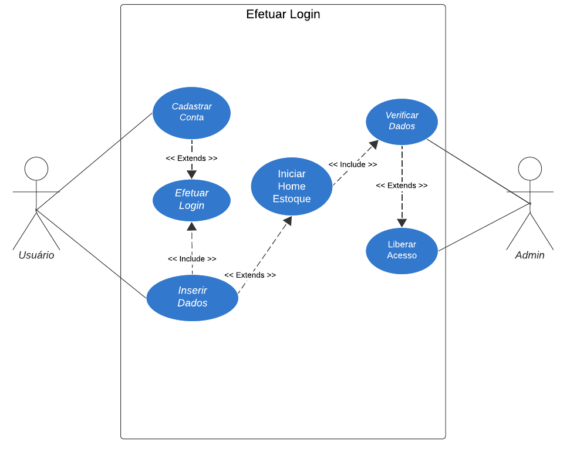
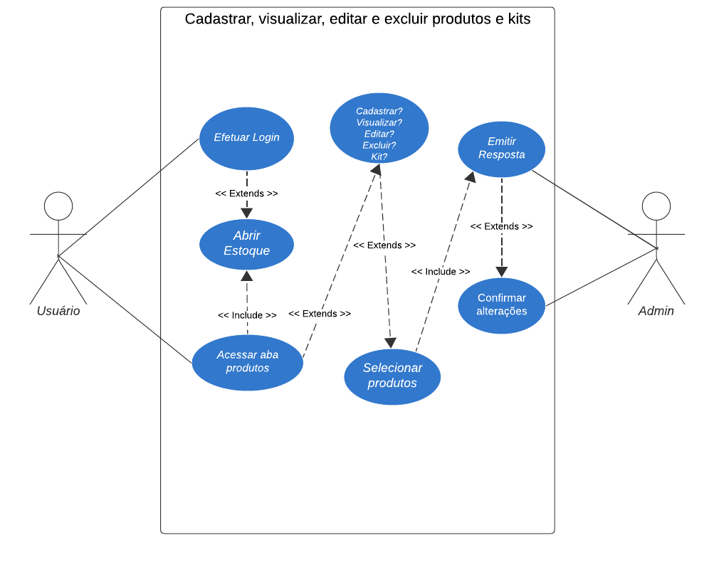
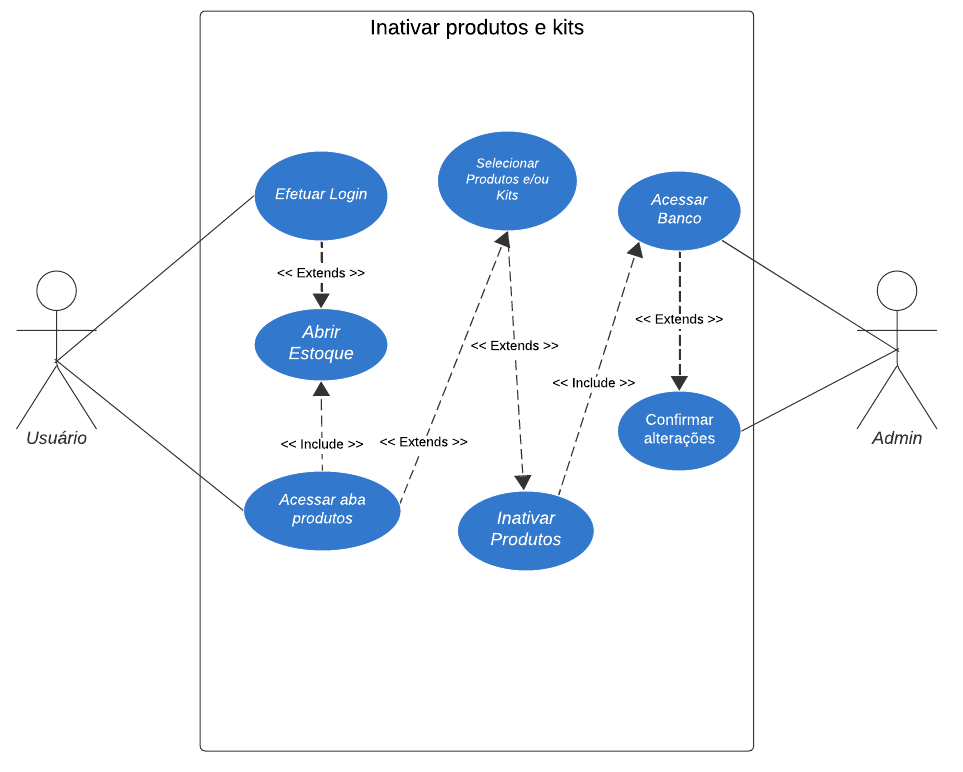
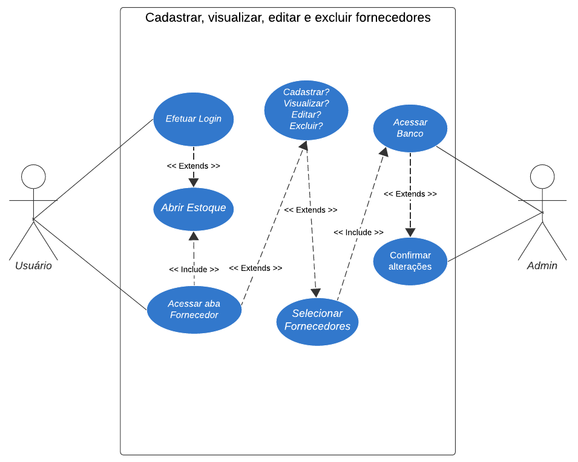
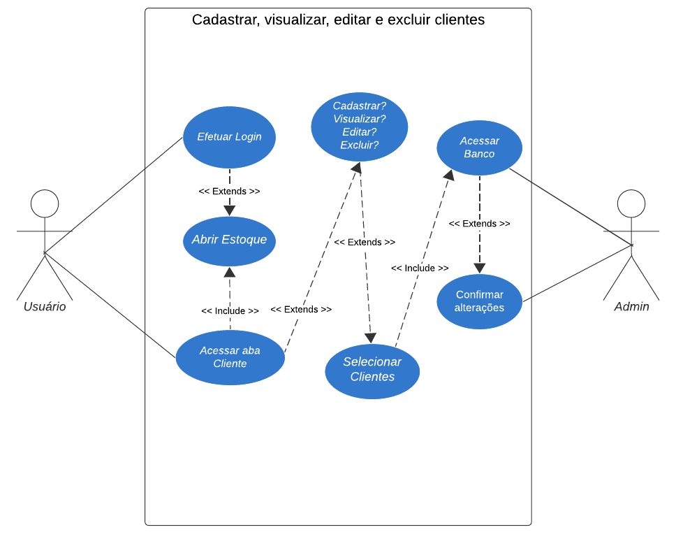
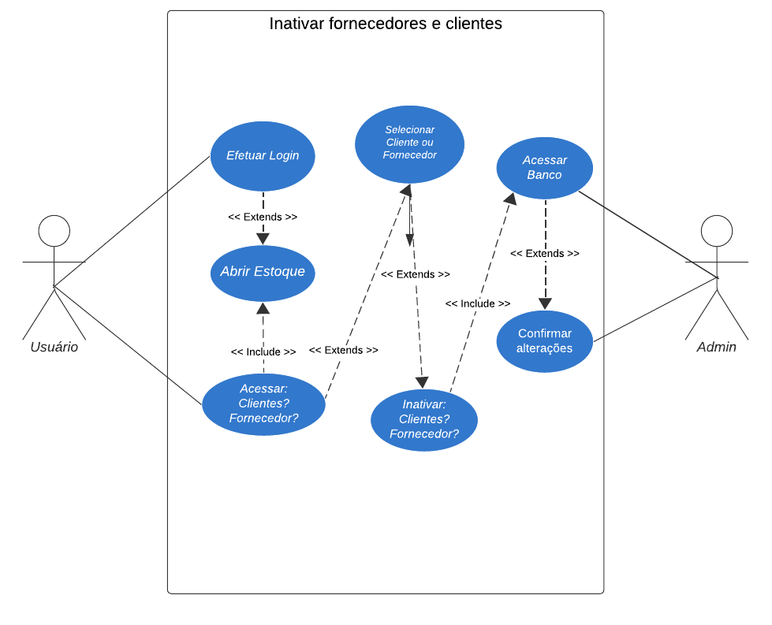
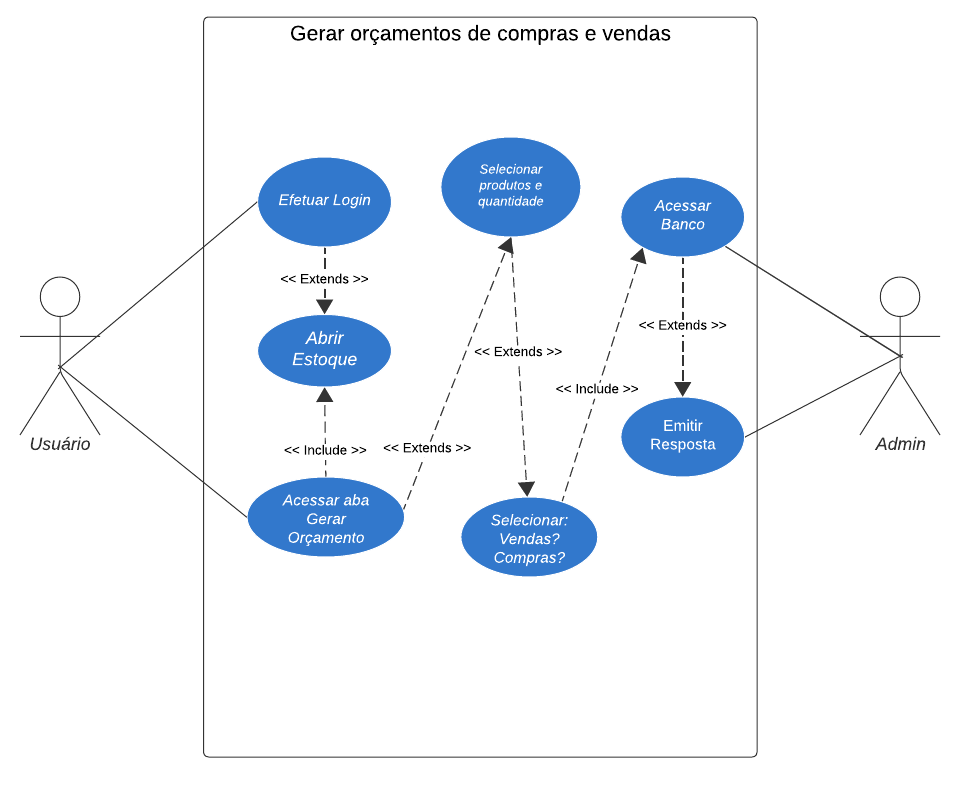
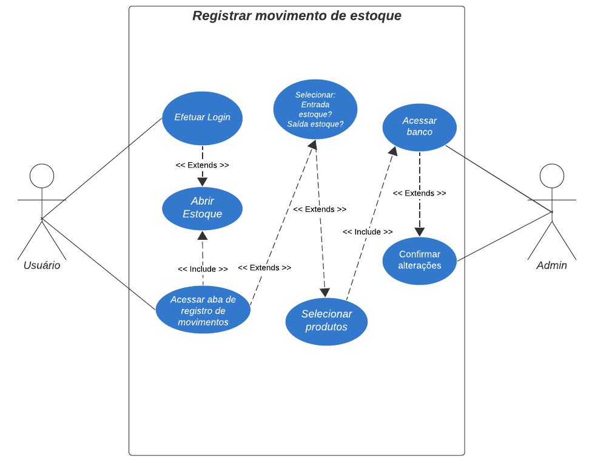

# 4.3. Casos de uso
A documentação de casos de uso descrita a seguir oferece uma visão geral e simplificada das funcionalidades chave do sistema, facilitando a compreensão dos processos pelos quais os usuários podem efetuar suas principais tarefas:
### RF-001 Login
Usuários acessam o sistema inserindo suas credenciais. Uma validação bem-sucedida redireciona para a tela principal, enquanto erros nas credenciais geram mensagens de alerta.

### RF-003 Cadastrar, visualizar, editar e excluir produtos e kits
Usuários com permissões adequadas podem adicionar, visualizar, editar e excluir registros. Esse conjunto de funcionalidades é essencial para manter atualizadas as informações sobre produtos e kits.

### RF-005 Inativar produtos e kits
Permite que usuários inativem produtos e kits que não estão mais disponíveis para venda, mantendo-os registrados para fins históricos.

### RF-006 Cadastrar, visualizar, editar e excluir fornecedores
Usuários com permissões adequadas podem adicionar, visualizar, editar e excluir registros. Esse conjunto de funcionalidades é essencial para manter atualizadas as informações sobre fornecedores.

### RF-007 Cadastrar, visualizar, editar e excluir clientes
Usuários com permissões adequadas podem adicionar, visualizar, editar e excluir registros. Esse conjunto de funcionalidades é essencial para manter atualizadas as informações sobre clientes.

### RF-008 Inativar fornecedores e clientes
Permite que usuários inativem fornecedores e clientes que não estão mais no negócio, mantendo-os registrados para fins históricos.

### RF-015 Gerar orçamento de compras e vendas
Os usuários podem gerar orçamentos detalhados para compras e vendas, facilitando o processo de negociação e registro de transações comerciais.

### RF-018 Registrar movimento de entrada e saída do estoque
Essencial para o controle de estoque, esta funcionalidade permite registrar entradas e saídas de produtos, ajudando a manter a acurácia dos dados de inventário.

[4.4 - Diagrama de Classes](4.4-Projeto.md)
