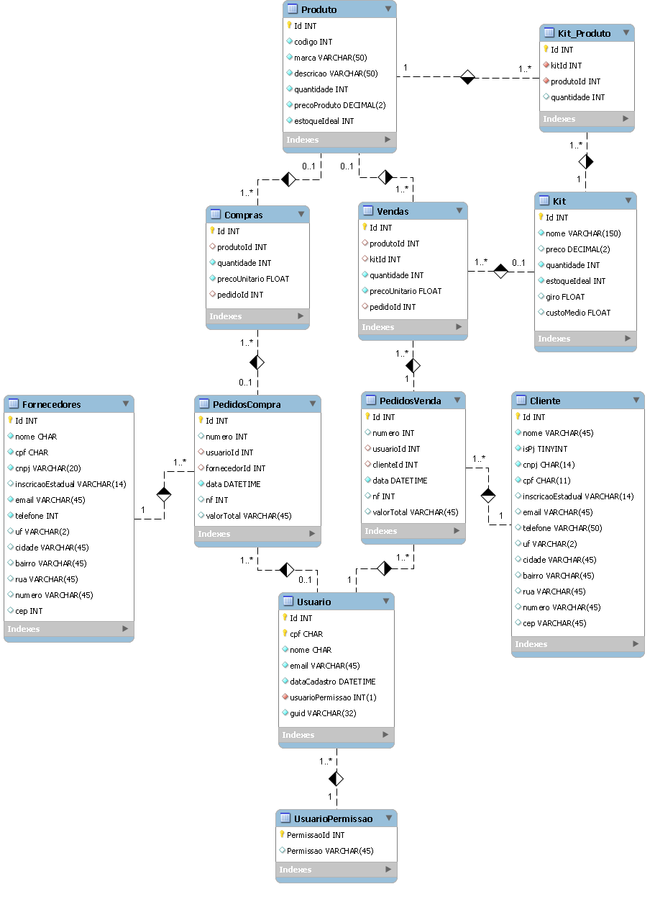

# 4.4 Diagrama de Classes
Criamos para o modelo dois fluxos verticais, ao lado esquerdo o de compras e ao lado direito o de vendas. Como pode ser observado, os fluxos têm intercessão quando os relacionamos com o produto, incluindo os kits, e com o usuário que controla estes dois processos. Em contrapartida, em certo ponto do relacionamento há dispersão de ligações, onde as compras estão ligadas aos fornecedores e não aos clientes, e as vendas estão ligadas aos clientes e não aos fornecedores. Esta é uma visão geral sobre o banco de dados do modelo, de forma que achamos mais coerente e organizada para atender às demandas do usuário, conforme os requisitos levantados.  

Partindo para uma análise mais específica, começando pelo topo, temos a tabela "Produto" como uma entidade forte e, por isso, contendo somente seus atributos necessários, sem nenhuma chave estrangeira. Por haver uma relação onde, se não houver produto, não há kit, a tabela "Kit" é uma entidade fraca da tabela "Produto", mesmo possuindo seus atributos próprios. Para melhor relacionar e organizar a relação entre produtos e kits, criamos a tabela "Kit_Produto" onde é formado o kit com base nos produtos que o compõem. Portanto, esta última, por sua vez, possui duas chaves estrangeiras: id do produto e id do kit que é formado.  

Após a análise dos itens que são comercializados, temos a relaçao destes com os processos de compra e venda. A tabela "Produto" tem sua chave primária trasnferida para as tabelas "Compras" e "Vendas", como chave estrangeira. Isto porque as compras são exclusivas de produtos e as vendas possuem relação com produtos e kits, já que um mesmo cliente pode adquirir produto e kit até mesmo em um único pedido. Para consolidar esta relação das vendas também com os kits, a sua tabela apresenta chave estrangeira vinda tanto da tabela "Produto" quanto da tabela "Kit".  

Agora, analisando as dispersões no fluxo que representa as tabelas, para melhor fazer uma relação de compras com fornecedores e de vendas com clientes, criamos as tabelas "PedidosCompra" e "PedidosVenda" que têm o intuito de organizar separadamente todas as compras e todas as vendas realizadas. As tabelas "Forncedores" e "Cliente" são entidades fortes, com seus atributos muito bem definidos, e que transferem suas chaves primárias como chaves estrangeiras, respectivamente para as tabelas "PedidosCompra" e "PedidosVenda".

Ao final, temos as tabelas "Usuario" e "UsuarioPermissao" que se relacionam em uma espécie de mão dupla, isto é, não existe um sem existir o outro. No entanto, a tabela do usuário recebe a chave primária da tabela de permissão do usuário como chave estrangeira, assim consolidando esta ligação. O objetivo da tabela "UsuarioPermissao" é representar qual a função que o usuário pode exercer na tabela, como por exemplo: somente editar, ativar comandos DELETE, somente incluir dados, etc. Por fim, a tabela "Usuario" precisa transferir sua chave primária para as tabelas de compras e vendas que a recebem como chave estrangeira, pois o usuário da empresa pode realizar as duas tarefas.

[4.5 - Fluxo da aplicação](4.5-Projeto.md)
