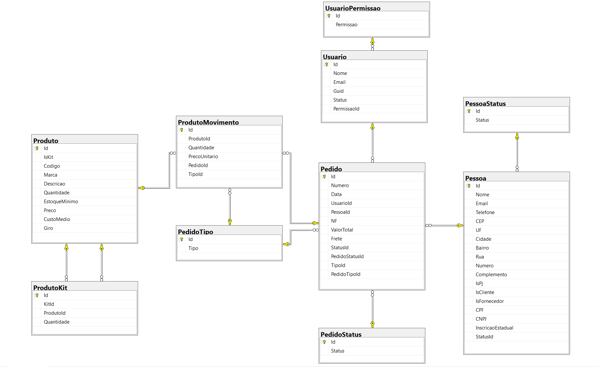

# 4.4 Diagrama de Classes
Optamos por um modelo mais normalizado onde os dados se repetem menos e assim podemos diminuir a quantidade de campos com valores nulos.

A tabela "Pessoa" possui campos como "IsFornecedor" e "IsCliente", pois poderemos utilizar o mesmo cadastro caso um fornecedor se torne cliente e vice-versa.

Para a tabela "Produto", criamos a tabela "ProdutoKit" que armazenará as informações dos produtos que são kits, relacionando o Id do produto com o Id dos produtos que compõe o kit.

A tabela "ProdutoMovimento" irá armazenar os movimentos do estoque para gerar relatórios e alimentar os indicadores.

A tabela "Pedido" irá armazenar as informações resumidas do movimento, por exemplo o fornecedor e número do pedido/nf, e os movimentos serão registrados na tabela "ProdutoMovimento". Através da tabela Pedido também será possível alimentar os indicadores de monitoramento de clientes e fornecedores.

A tabela "PedidoStatus" representa apenas o status do pedido, que pode ser concluído, cancelado ou em aberto.

A tabela "PedidoTipo" identifica se um pedido é de compra ou venda, que são os tipos do pedido. Basicamente é a diferenciação entre movimentos de entrada e saída do estoque.

Ao final, temos as tabelas "Usuario" e "UsuarioPermissao" que se relacionam em uma espécie de mão dupla, isto é, não existe um sem existir o outro. No entanto, a tabela do usuário recebe a chave primária da tabela de permissão do usuário como chave estrangeira, assim consolidando esta ligação. O objetivo da tabela "UsuarioPermissao" é representar qual a função que o usuário pode exercer na tabela, como por exemplo: somente editar, ativar comandos DELETE, somente incluir dados, etc. Por fim, a tabela "Usuario" precisa transferir sua chave primária para as tabelas de compras e vendas que a recebem como chave estrangeira, pois o usuário da empresa pode realizar as duas tarefas.

[Próximo: 4.5 - Fluxo da aplicação](4.5-Fluxo-da-aplicacao.md)
