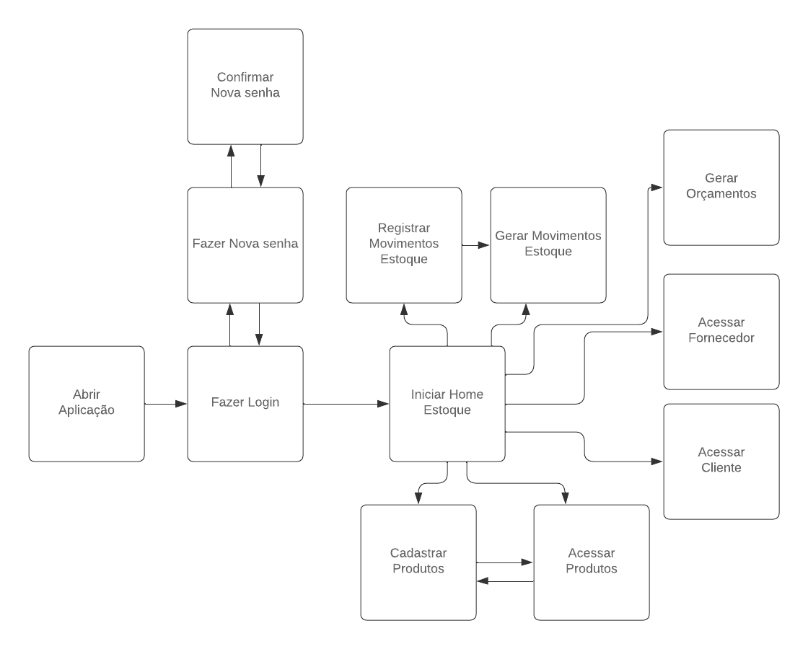

# 4.5 Fluxo da Aplicação
O fluxo de telas da aplicação é intuitivo e eficiente, começando com a abertura do aplicativo, seguido pelas opções de login, cadastro ou alteração de senha. Uma vez autenticado, o usuário é redirecionado para a tela 'Home Estoque'. Nesta área, encontram-se diversas funcionalidades importantes: 'Cadastrar Produtos', que permite a inclusão de novos itens no inventário; 'Produtos', onde é possível visualizar todos os itens cadastrados; 'Registrar Movimentos de Estoque', que facilita o controle de entradas e saídas; 'Movimentos Estoque', para consultar o histórico de movimentações; 'Gerar Orçamentos', que auxilia na criação de estimativas de custo para clientes; 'Cadastrar Fornecedor', essencial para a inclusão de novos parceiros comerciais; e 'Cadastrar Cliente', que permite adicionar informações de novos compradores.

1. Acessar o site
2. Fazer login
3. Redirecionamento para tela de login da microsoft
4. Tela Inicial do estoque ( uma tabela com os produtos, códigos, nomes, valores, etc... Também com os botões para fazer as ações:
5. Cadastrar produto (modal, aqui dentro podemos escolher através de uma chavinha se é kit ou novo produto (mercadoria))
6. Registrar movimento (nova tela? ou usamos modal?)
7. Tela do produto ( editar, inativar, etc)
8. Gerar orçamento (nova tela? ou usamos modal?)
9. Movimentos do Estoque

[4.6 - Fluxo de Telas](4.6-Projeto.md)