# 4.6 Telas da Aplicação

## Login
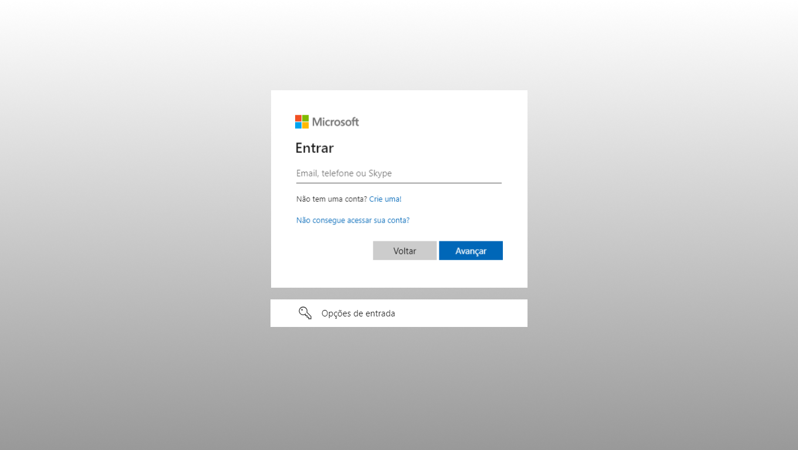
Tela de Login simples e intuitiva com a aparência da Microsoft. Basta o usuário entrar com sua conta microsoft e será redirecionado para a página inicial.

## Tela inicial
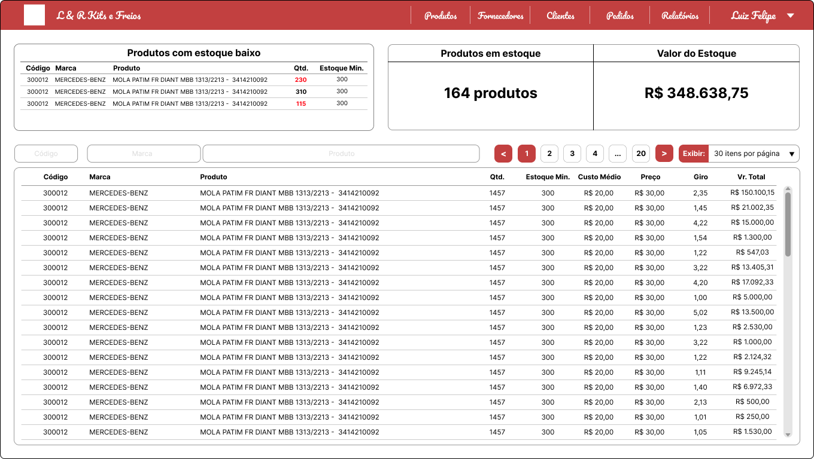
Optamos por uma tela inicial que já exibe o estoque com os itens na ordem desejada, assim como um campo para exibir os produtos que estão com o estoque baixo (próximo ou inferior ao estoque mínimo).  
Também consideramos interessante exibir a quantidade de produtos em estoque e o valor total do Estoque.

# Fornecedores
## Cadastrar Fornecedores (Botão)
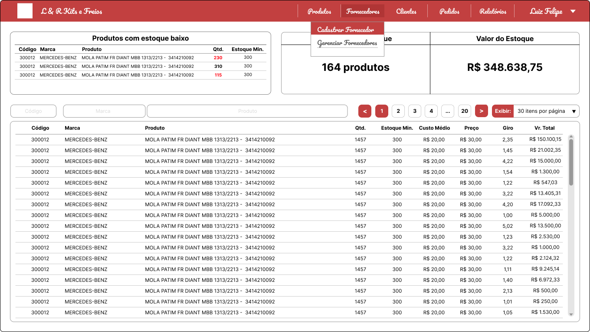
Para cadastrar um novo fornecedor, basta clicar no botão Fornecedores e então clicar em Cadastrar Fornecedor. Será aberto um Modal com os campos a serem preenchidos.

## Cadastrar Fornecedores (Cadastro PJ)

Optamos por um modal nas telas de cadastro para ganhar tempo e evitar mudanças de telas, uma vez que este pode ser reutiliado em outros ambientes da ferramenta e não exige uma mudança imediata para qualquer página de visualização do fornecedor após seu cadastro.  
O Modal possui uma chave para selecionar se o fornecedor cadastrado é pessoa física ou jurídica, com a finalidade de exibir os campos conforme o tipo de cadastro, uma vez que pessoas físicas possuem CPF ao invés de CNPJ e não possuem Inscriçao Estadual.

## Cadastrar Fornecedores (Cadastro PF)
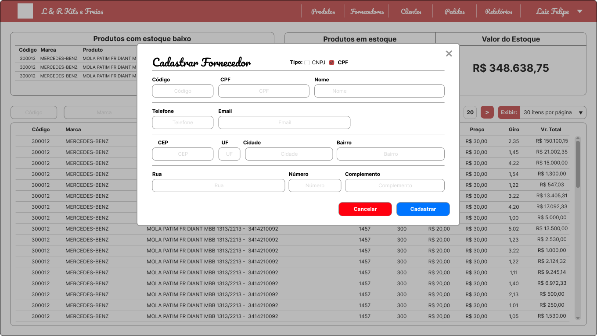
Exemplo do Modal com a chave de seleção para pessoas físicas (CPF) selecionada.

## Cadastro de Fornecedores (Botão)
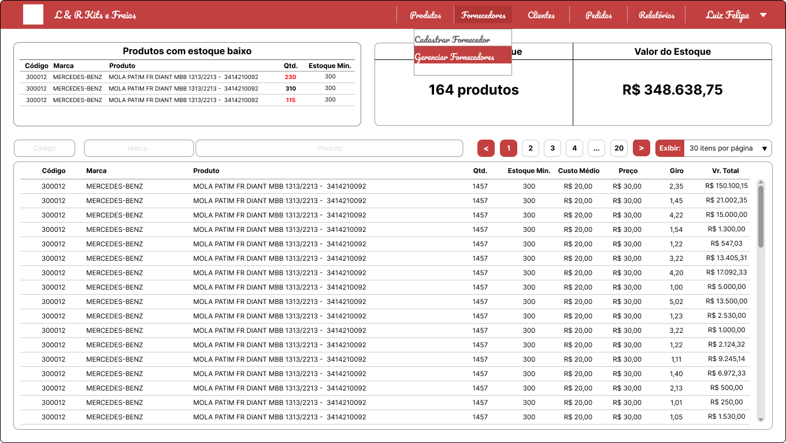
Para visualizar todos os fornecedores cadastrados, basta clicar no botão fornecedores e então clicar em Gerenciar Fornecedores.  
O usuário será redirecionado para uma tela com uma tabela de fornecedores cadastrados.

## Cadastro de Fornecedores (Tela)

A tabela com os fornecedores cadastrados possui campos para filtro rápido, em que os resultados da tabela são atualizados conforme o usuário digita os valores nos campos de busca.  
Ao clicar no cadastro de um fornecedor, o usuário será redirecionado para a tela de detalhes do fornecedor.

## Editar, Inativar, Excluir e Visualizar Fornecedor
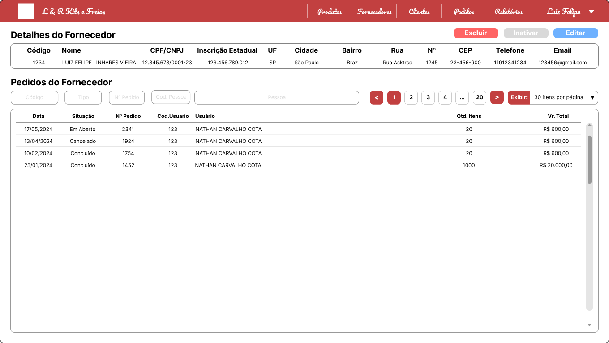
Na tela de Detalhes do fornecedor, o usuário pode editar as informações do fornecedor (apenas os campos editáveis, não os calculados), inativar ou excluir o cadastro.  
Não é possível excluir um fornecedor uma vez que existem movimentos (entradas e/ou saídas) vinculadas ao fornecedor.
Também é exibida uma tabela com os pedidos relacionados ao fornecedor.

# Clientes
As tela de cadastro de Clientes são exatamente iguais as telas de cadastro dos Fornecedores, pois estes possuem os mesmos campos de preenchimento e os dados armazenados no sistema são similares.

## Cadastrar Clientes (Botão)
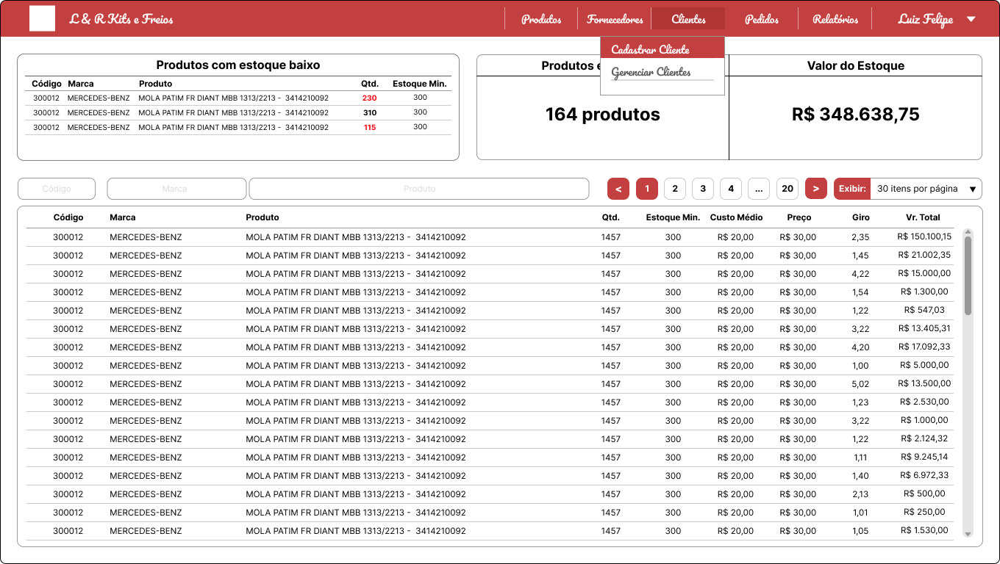
Para cadastrar um novo cliente, basta clicar no botão Clientes e então clicar em Cadastrar Cliente. Será aberto um Modal com os campos a serem preenchidos.

## Cadastrar Clientes (Cadastro PJ)
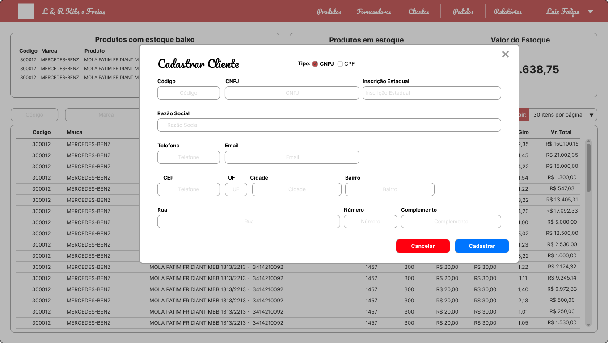
Tela com o Modal de cadastro de Clientes PJ. Os campos são os mesmos do cadastro de Fornecedores.

## Cadastrar Clientes (Cadastro PF)

Tela com o Modal de cadastro de Clientes PF. Os campos são os mesmos do cadastro de Fornecedores.

## Cadastro de Clientes (Botão)
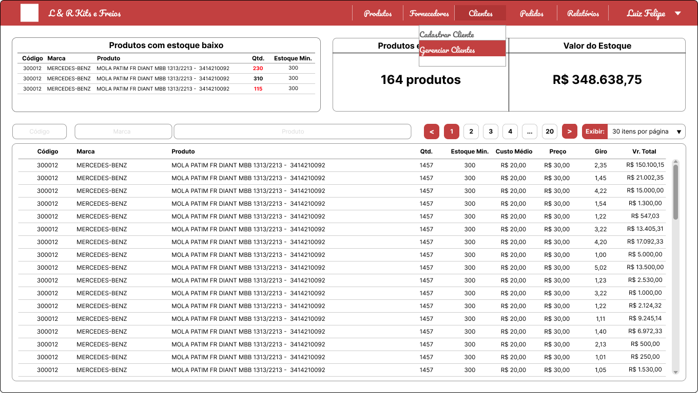
Para visualizar os clientes cadastrados o usuário precisa clicar em Clientes, e então em Gerenciar Clientes. Será exibida uma tabela com os cadastros dos clientes.

## Cadastro de Clientes (Tela)
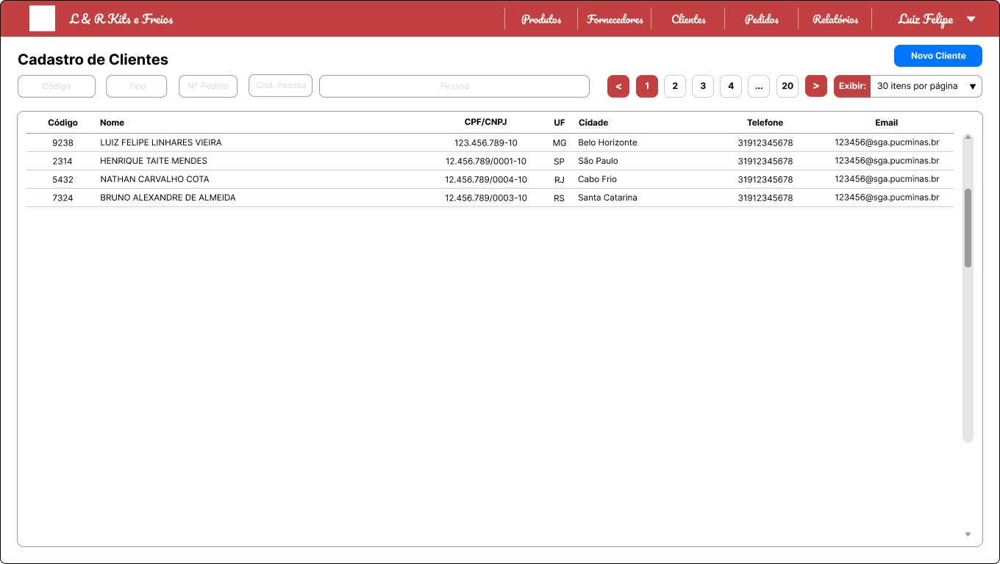
A tabela com os clientes cadastrados também possui campos para filtro rápido, em que os resultados da tabela são atualizados conforme o usuário digita os valores nos campos de busca.  
Ao clicar no cadastro de um cliente, o usuário será redirecionado para a tela de detalhes do cliente.

## Editar, Inativar, Excluir e Visualizar Cliente
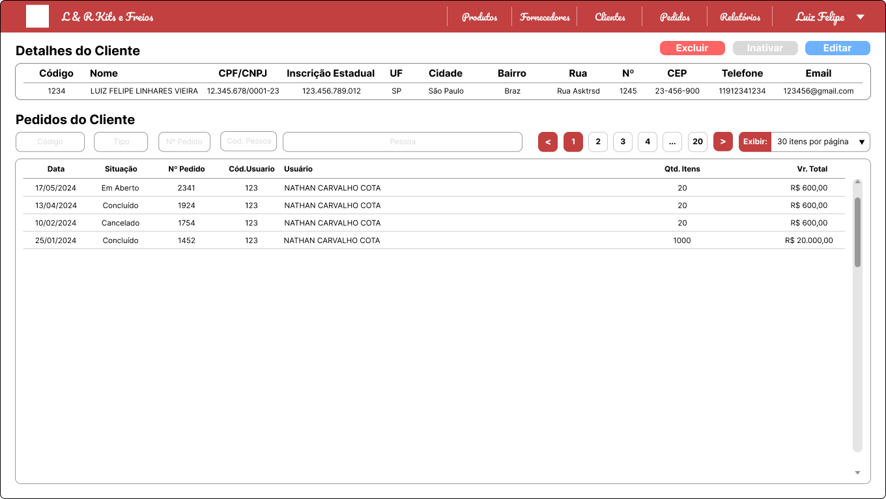
Na tela de Detalhes do cliente, o usuário pode editar as informações do cliente (apenas os campos editáveis, não os calculados), inativar ou excluir o cadastro.  
Não é possível excluir um cliente uma vez que existem movimentos (entradas e/ou saídas) vinculadas ao cliente.
Também é exibida uma tabela com os pedidos relacionados ao cliente.

# Produtos
## Cadastrar produtos (Botão)
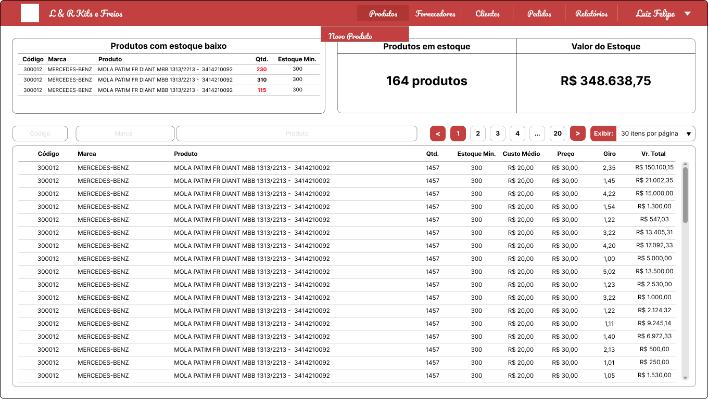
Para cadastrar novos produtos, o usuário deve clicar em Produtos e então clicar em Novo Produto. Será aberto um Modal com os campos que devem ser preenchidos.

## Cadastrar produtos (Produto Simples)
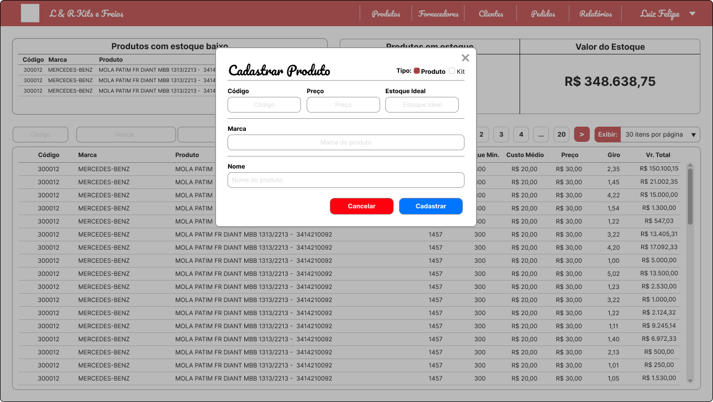
Modal para cadastro de produtos simples

## Cadastrar produtos (Kit - 1)
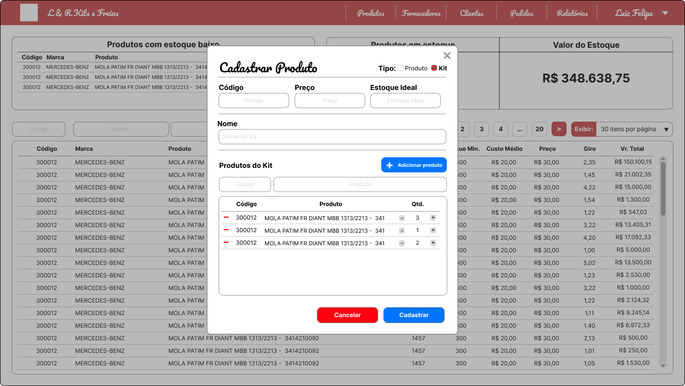

## Cadastrar produtos (Kit - 2)
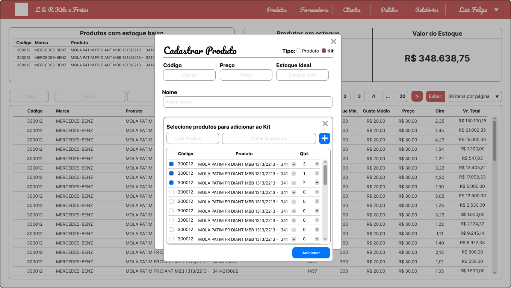

## Detalhes do Produto (Produto Simples)
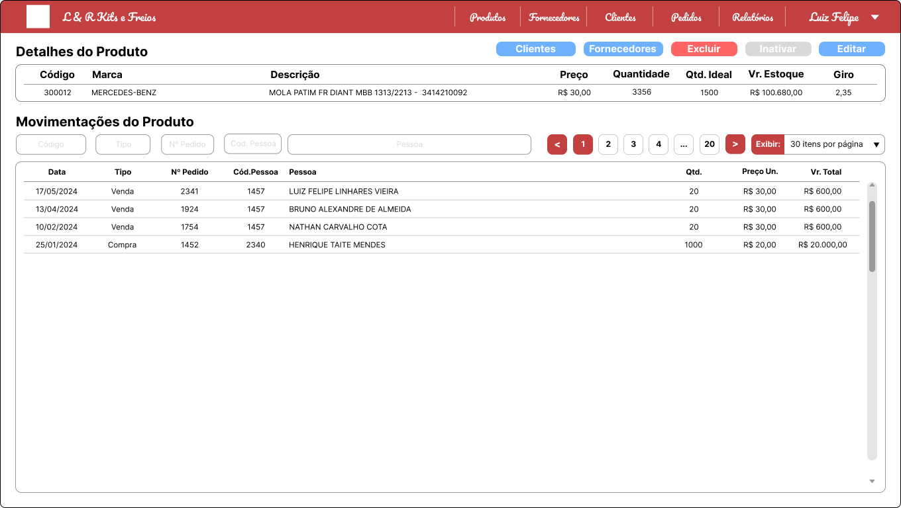

# Pedidos de Compra
## Novo Pedido de Compra (Botão)

## Novo Pedido de Compra (Cadastro)

## Lista dos Pedidos de Compra (Tela)

# Pedidos de Venda
## Novo Pedido de Venda (Botão)
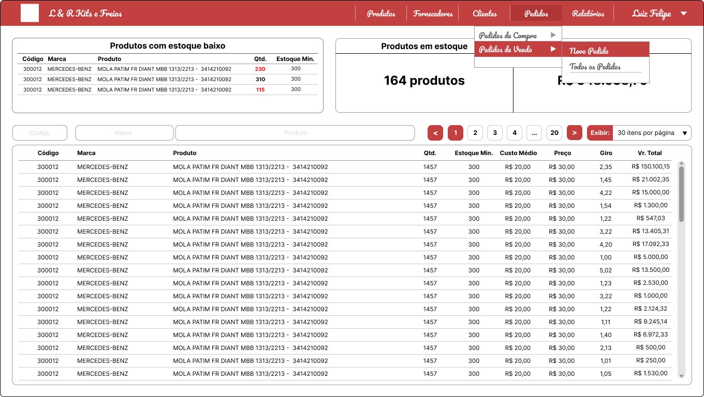

## Novo Pedido de Venda (Cadastro)
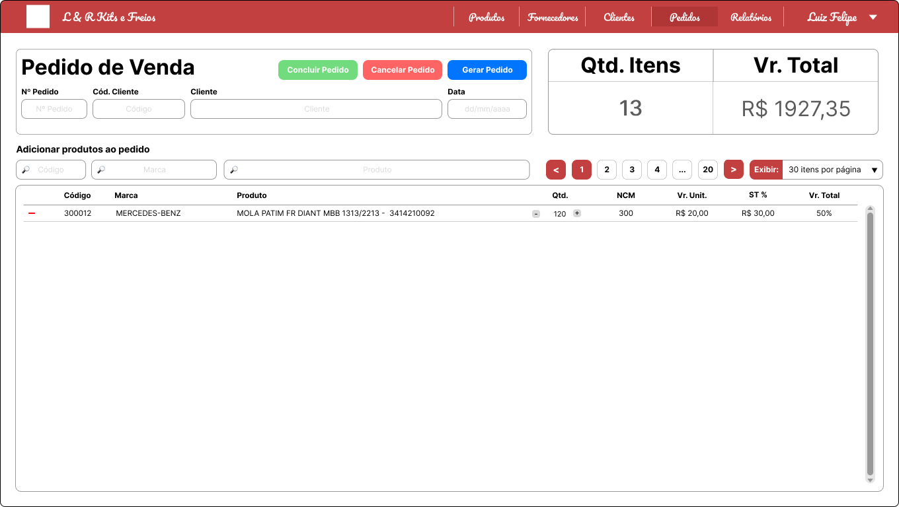

## Lista dos Pedidos de Venda (Tela)
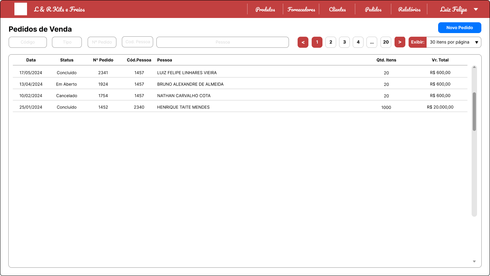

# Logout (Botão)
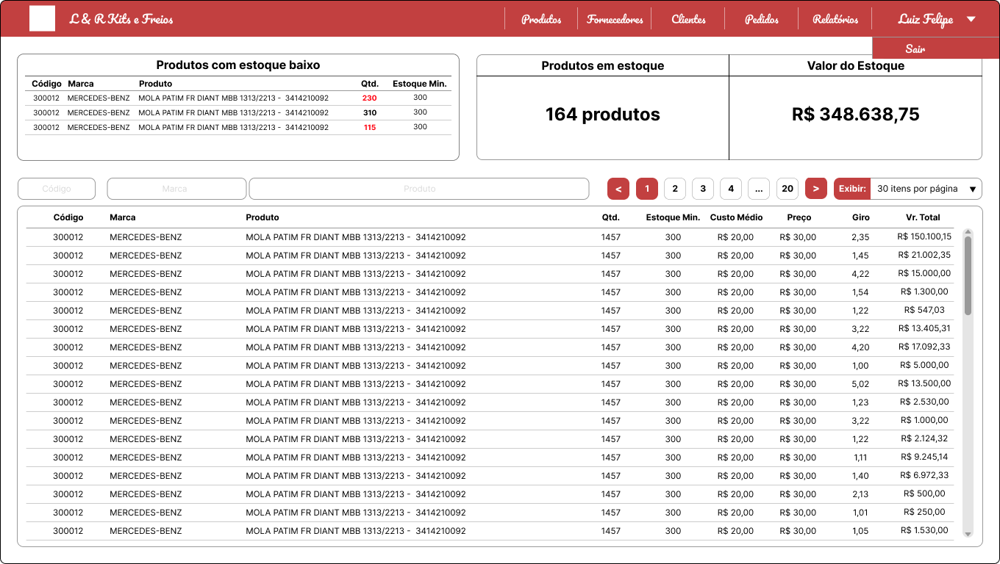
Para fazer o Logout, o usuário deve clicar no botão com o seu nome, e então clicar em Sair.