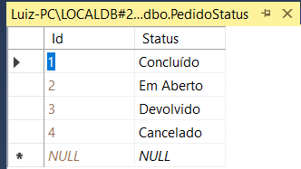

# 5.1. Protótipo do produto 

O protótipo da aplicação está disponível em [Telas da aplicação](4.6-Telas-da-aplicacao.md), e os requisitos foram atendidos da seguinte maneira:

## Requisitos Funcionais
|  ID	|  Descrição do Requisito	| Tela Correspondente |
|  ---  |  ---  | --- |
|  RF-001  |  Fazer login através de conta microsoft					| [Tela Inicial](4.6-Telas-da-aplicacao.md#Tela-inicial) |
|  RF-003  |  Cadastrar, visualizar, editar e excluir produtos			| [Produtos](4.6-Telas-da-aplicacao.md#Produtos) |
|  RF-004  |  Cadastrar, visualizar, editar e excluir kits de produtos  | [Kits](4.6-Telas-da-aplicacao.md#cadastrar-produtos-kit--1) |
|  RF-005  |  Inativar produtos e kits									| [Inativar](4.6-Telas-da-aplicacao.md#detalhes-do-produto-produto-simples) |
|  RF-006  |  Cadastrar, visualizar, editar e excluir fornecedores		| [Fornecedores](4.6-Telas-da-aplicacao.md#fornecedores) |
|  RF-007  |  Cadastrar, visualizar, editar e excluir clientes			| [Clientes](4.6-Telas-da-aplicacao.md#clientes) |
|  RF-008  |  Inativar fornecedores e clientes							| [Editar Fornecedores](4.6-Telas-da-aplicacao.md#editar-inativar-excluir-e-visualizar-fornecedor)   [Editar Clientes](4.6-Telas-da-aplicacao.md#editar-inativar-excluir-e-visualizar-cliente)|
|  RF-009  |  Gerar orçamentos de compras e vendas						| [Pedidos de compra](4.6-Telas-da-aplicacao.md#pedidos-de-compra)   [Pedidos de venda](4.6-Telas-da-aplicacao.md#pedidos-de-venda)|
|  RF-010  |  Registrar movimento de entrada e saída do estoque			| [Registrar Entrada](4.6-Telas-da-aplicacao.md#novo-pedido-de-compra-cadastro)   [Registrar Saída](4.6-Telas-da-aplicacao.md#novo-pedido-de-venda-cadastro)|
|  RF-011  |  Consultar disponibilidade de produtos em estoque			| [Tela Inicial](4.6-Telas-da-aplicacao.md#tela-inicial) |
|  RF-012  |  Gerar relatório de entradas e saídas						| [Relatórios](4.6-Telas-da-aplicacao.md#relatorios) |
|  RF-013  |  Gerar relatório de produtos em estoque					| [Relatórios](4.6-Telas-da-aplicacao.md#relatorios) |
|  RF-014  |  Visualizar os movimentos do estoque						| [Lista de Entradas](4.6-Telas-da-aplicacao.md#lista-dos-pedidos-de-compra-tela)   [Lista de Saídas](4.6-Telas-da-aplicacao.md#lista-dos-pedidos-de-venda-tela)|

## Banco de Dados

Abaixo estão os exemplos das tabelas devidamente preenchidas com informações de teste no banco de dados.

### Tabelas Criadas
Demonstração das tabelas criadas no banco da dados.  

### Tabela Pedido
Tabela que armazena as informações dos pedidos.  

### Tabela PedidoStatus
Tabela que armazena os tipos de status que o pedido pode ter.  

### Tabela PedidoTipo
Tabela que armazena os tipos do pedido (compra ou venda), se é entrada ou saída.  

### Tabela Pessoa
Tabela que armazena as informações dos clientes e fornecedores  

### Tabela PessoaStatus
Tabela que armazena os status dos clientes e forneccedores.  

### Tabela Produto
Tabela que armazena as informações dos produtos cadastrados.  

### Tabela ProdutoKit
Tabela que relaciona os kits com os produtos que compõe os kits.  

### Tabela ProdutoMovimento
Tabela que armazena o movimento de entrada ou saída do estoque.  

### Tabela Usuario
Tabela que armazena as informações dos usuários que podem acessar o sistema.  

### Tabela UsuarioPermissao
Tabela que armazena os tipos de permissão que os usuários podem ter.  

[Próximo: 5.2 - Indicadores e objetivos do negócio](5.2-Indicadores-e-objetivos-do-negocio.md)